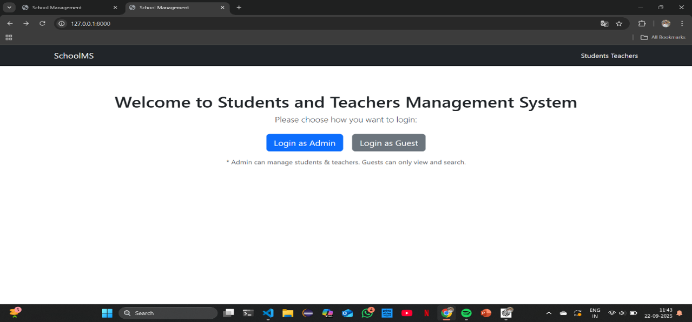
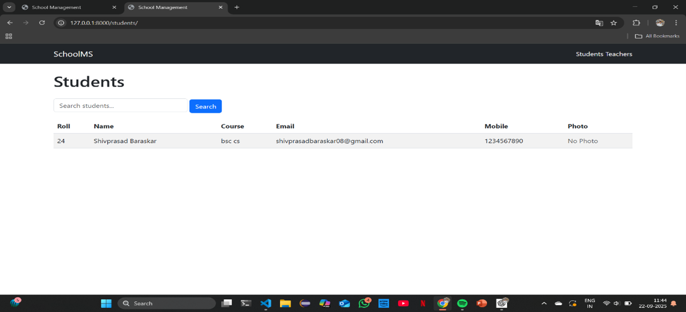
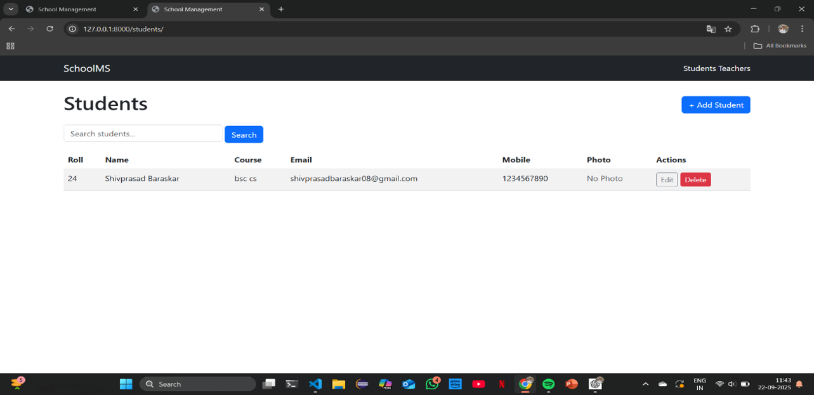

# Student and Teacher Management System

A role-based web application built using Django that helps manage student and teacher records efficiently. The system provides separate access levels for Admin and Guest users, allowing secure management and viewing of school data.

---

## Features

### Admin
- Add new students and teachers
- Update existing records
- Delete records
- Search students and teachers
- Upload student photos
- Manage student course information
- Full CRUD operations

### Guest
- View student records
- View teacher records
- Search records
- Read-only access

---

## Student Information

The system stores the following student details:

- Roll Number
- Name
- Address
- Course
- Email
- Mobile Number
- Photo

---

## Teacher Information

The system stores the following teacher details:

- Name
- Subject
- Qualification
- Email
- Mobile Number

---

## Technologies Used

- Python
- Django
- SQLite
- HTML
- CSS
- Bootstrap

---

## Project Structure

```text
Student-Teacher-Management-System/
│
├── core/
├── school_management/
├── Screenshots/
├── db.sqlite3
├── manage.py
├── README.md
└── .gitignore
```

---

## Screenshots

### Home Page

The landing page of the Student and Teacher Management System. Users can choose to log in as an **Admin** or continue as a **Guest**.



---

### Guest View - Student Records

Guest users can view and search student records. They have read-only access and cannot add, edit, or delete any information.



---

### Admin Dashboard - Student Management

Admin users have full access to manage student records. They can add new students, update existing information, delete records, and perform searches.



## Installation

### Clone Repository

```bash
git clone https://github.com/shivprasad000/Student-Teacher-Management
```

### Navigate to Project

```bash
cd Student-Teacher-Management-System
```

### Create Virtual Environment

```bash
python -m venv venv
```

### Activate Virtual Environment

#### Windows

```bash
venv\Scripts\activate
```

#### Linux / macOS

```bash
source venv/bin/activate
```

### Install Dependencies

```bash
pip install -r requirements.txt
```

### Run Migrations

```bash
python manage.py migrate
```

### Start Server

```bash
python manage.py runserver
```


---

## Learning Outcomes

This project helped in understanding:

- Django Models
- Django Views
- Django Templates
- Authentication & Authorization
- CRUD Operations
- File Upload Handling
- SQLite Database Integration
- Search Functionality
- Role-Based Access Control

---

## Author

**Shivprasad Baraskar**

